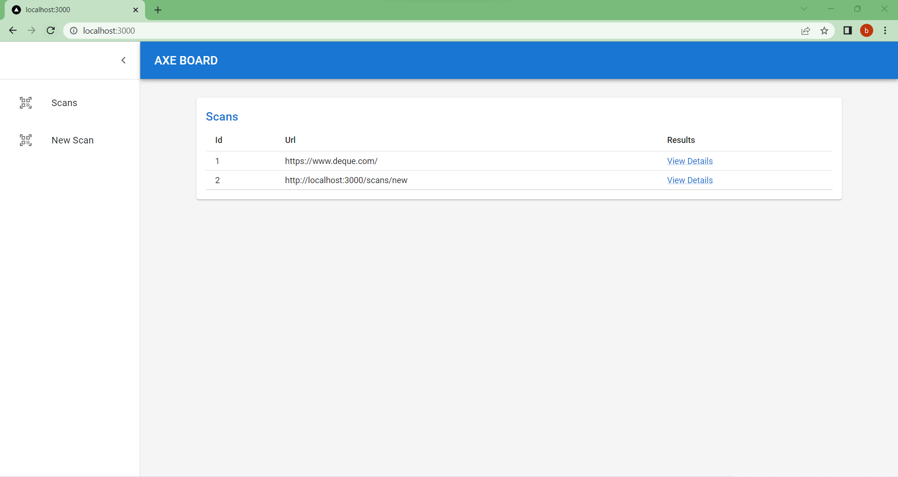
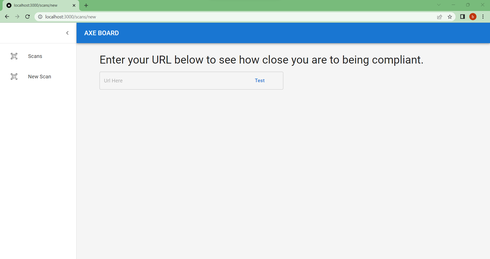
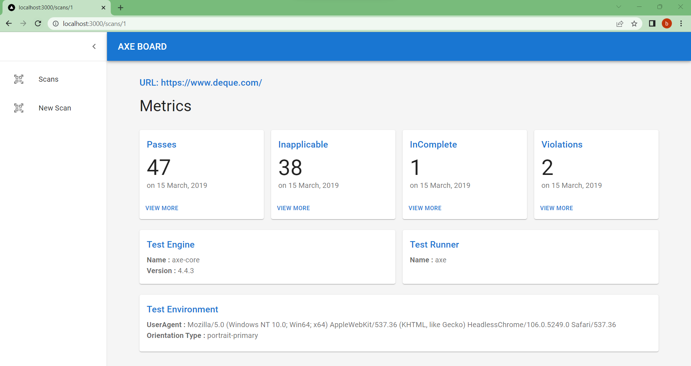
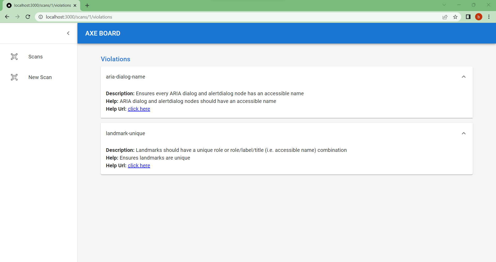

# Axe Board
Axe Board is an accessibility testing application for websites and other HTML-based user interfaces. Designed using on Axe Core Engine.

https://www.npmjs.com/package/@axe-core/puppeteer

# Prerequisite
- Nodejs
- MySQL
- VsCode

# Environment Variables in .env file 
Update env file with your local database credentials.

## Local database
LOCAL_DB_DATABASE=
LOCAL_DB_USER=
LOCAL_DB_PASSWORD=
LOCAL_HOST=localhost

Install it and run:

```sh
npm install
npm run dev
```

## Scans Screen


## New Scan


## Scan Metrics


## Scan Sections
